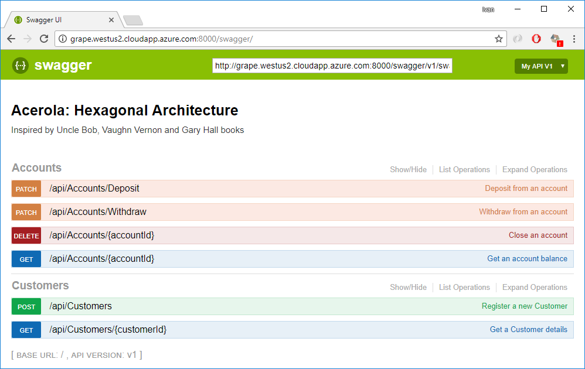

# Acerola: Hexagonal Architecture
A solution with Ports and Adapters.


# Requirements
* [Visual Studio 2017 with Update 3](https://www.visualstudio.com/en-us/news/releasenotes/vs2017-relnotes)
* [.NET SDK 2.0](https://www.microsoft.com/net/download/core)
* [Docker](https://docs.docker.com/docker-for-windows/install/)

# Main Arquitetural Concepts

## DDD
Soon..

## TDD
Soon..

## CQRS
Soon..

## SOLID
Soon..

## Hexagonal Architecture / Ports and Adapters
Soon..

## Microservice
Soon..

## Docker
Soon..

## .NET Core 2.0
Soon..

# Environment setup

* Run the `./prerequisites.sh` script to download the MongoDB image and run it as a Docker container. 
Please wait until the ~400mb download to be complete.

```
$ ./prerequisites.sh
Pulling mongodb (mongo:latest)...
latest: Pulling from library/mongo
Digest: sha256:2c55bcc870c269771aeade05fc3dd3657800540e0a48755876a1dc70db1e76d9
Status: Downloaded newer image for mongo:latest
Creating setup_mongodb_1 ...
Creating setup_mongodb_1
Creating setup_mongodb_1 ... done
```
* Check Mongo image with the the following commands:

```
$ docker images
REPOSITORY          TAG                 IMAGE ID            CREATED             SIZE
mongo               latest              d22888af0ce0        17 hours ago        361MB
$ docker ps
CONTAINER ID        IMAGE               COMMAND                  CREATED             STATUS              PORTS                                            NAMES
ba28cf144478        mongo               "docker-entrypoint..."   2 days ago          Up 2 days           0.0.0.0:27017->27017/tcp                         setup_mongodb_1
```

If everything goes well MongoDB will be running with the following connection string `mongodb://10.0.75.1:27017`.

# Running the latest Docker Build 

If you like you can run the latest Docker image of this project as following:

```
$ docker run -p 8000:80 -d \
		-e modules__2__properties__ConnectionString=mongodb://10.0.75.1:27017 \
		--name acerola-backend \
		ivanpaulovich/acerola:latest
```
Then navigate to http://localhost:8000/swagger and play with de Web API.

# We are live on Azure



You can play with the latest build by navigating to [the Swagger client](http://grape.westus2.cloudapp.azure.com:8000/swagger "Acerola Swagger") (All data is restored weekly)
